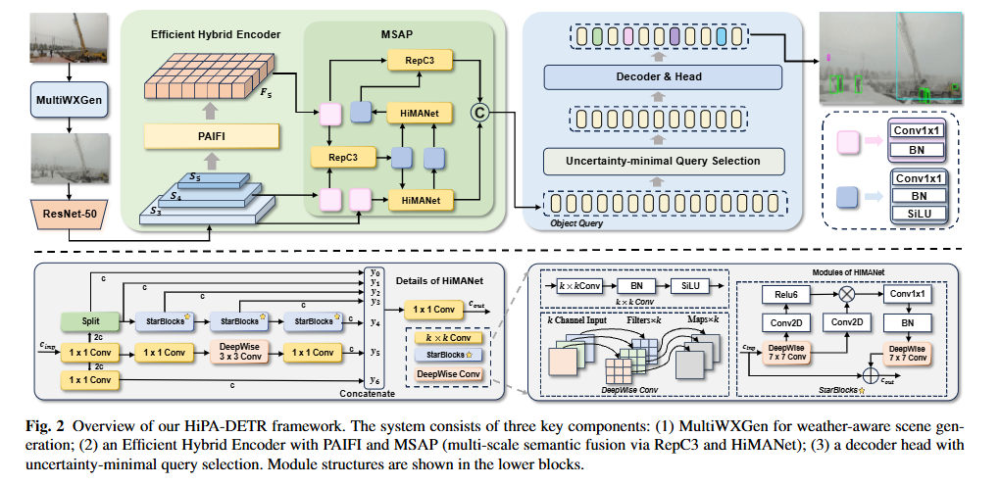

# Robust-Detection-in-Complex-Construction-Sites

<!-- Authors -->
Zenghuang Fu · Jinming Yang · Xiaofeng Han · Zhe Feng · Muyang Zhang · Changwei Wang · Weiliang Meng · Jiguang Zhang · Xiaopeng Zhang 

<!-- # MF-RV

 

  -->

### 1. Abstract
Object detection in construction sites presents significant challenges due to densely packed targets, frequent occlusions, varying object scales, and unstructured scene layouts. These difficulties are exacerbated by extreme weather conditions—such as fog, rain, snow, and lightning—which degrade image clarity and obscure object boundaries. Compounding the problem is the scarcity of real-world datasets captured under such adverse conditions, hindering model development and robustness assessment. To overcome this limitation, we develop MultiWXGen, a multi-modal weather synthesis module that generates realistic adverse-weather scenes based on the MOCS dataset, enabling controlled and diverse robustness testing. We further propose HiPA-DETR, a weather-resilient detector built on RT-DETR, featuring two novel components: HiMANet, a hierarchical semantic aggregator for enhanced multi-scale representation, and PAIFI, a polarity-aware interaction module that improves attention stability, particularly for small or low-texture objects. Extensive experiments validate that our HiPA-DETR achieves state-of-the-art performance on MOCS and its weather-augmented variants. Furthermore, it demonstrates strong generalization to real-world adverse weather datasets, including BDD100K, DAWN, and ACDC,underscoring its effectiveness in safety-critical construction perception under extreme conditions. The code is available in the supporting material.

### 2. Overview

   

  

### :star: Share us a :star:
Share us a :star: if you're interested in this repo. We will continue to track relevant progress and update this repository.
